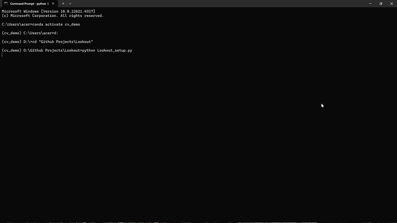

# Lookout - Unauthorized Laptop Access Detection


## Introduction

Here is my Python source code for an automatic security app that detects users and sends an alert if an unrecognized face is detected. By using the `face_recognition` library along with an anti-spoofing model, the app can identify unknown faces and capture their photo, then send an alert with the intruder’s image to the owner's Gmail.

<p align="center">
  <br/>
  <i>Model in Action</i>
</p>

## Motivation
This project was inspired by the meme below and my habit of leaving my laptop unattended in cafés or libraries — classic student behavior (lol) :sweat_smile:

<div align="center">
    
</div>

## How to use my code
### 🔧 Looker Setup
To set things up for the application, run: 
```bash
python Lookout_setup.py
```
After running the script, a GUI will appear where you can:
- **Configure the email addresses** to **receive security alerts**
- **Register authorized faces** that are allowed to **access the laptop** 


<p align="center">
  <br/>
  <i>Setup demo</i>
</p>

### 🔧 Build the Executable
To generate a standalone `.exe` file, follow these steps:
1. **Open terminal or command prompt**, then navigate to your project directory:

    ```bash
    cd path/to/Lookout
    ```

2. **Run PyInstaller** using the `.spec` file:

    ```bash
    pyinstaller Lookput.spec
    ```

3. After the process completes, a `/dist` folder will be created, containing:

    - A folder named `_internal`
    - The executable file `Looker.exe`

4. **Move both** `Looker.exe` and the `_internal/` folder into your `/Looker` directory.

5. **Try running `Looker.exe`** to verify if the application runs correctly.

6. Finally, create a Task Scheduler entry to run the app automatically after waking from sleep or hibernation.


## Installation
1. Clone the repository:

   ```bash
   git clone https://github.com/phuongvu0206/Lookout.git
   ```
   
2. Install dependencies:  

   ```bash
   pip install -r requirements.txt
   ```

