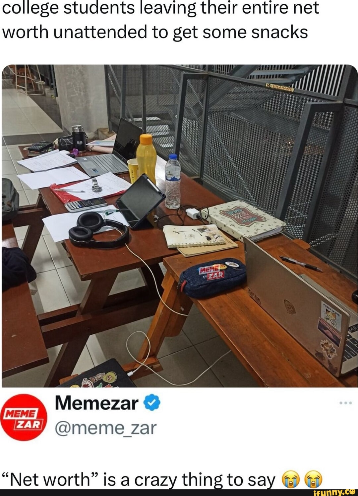

# Unauthorized Laptop Access Detection with Email Alerts

This is an automatic security app that activates upon startup or wake-up, capturing a 3-second facial scan to verify the user. If an unrecognized face is detected, the app instantly sends an alert with a photo of the intruder to the owner's Gmail, ensuring real-time protection against unauthorized access.

The inspiration for the project was the meme below.
<div align="center">
    
</div>


## Installation
1. Clone the repository:  
   `git clone https://github.com/yourusername/project-name.git`
2. Install dependencies:  
   `npm install`


## Usage
Run the app:  
`python main.py`

Example:  
```python
import my_module
my_module.run()
```

## Có thể nâng cấp
- Register bằng clip thay vì 1 bức
- Thay face recognition bằng model real-time chính xác hơn
- Gửi cả clip và GPS qua Gmail
- Thêm các model hỗ trợ bảo mật


## Features  
- Feature 1  
- Feature 2  

